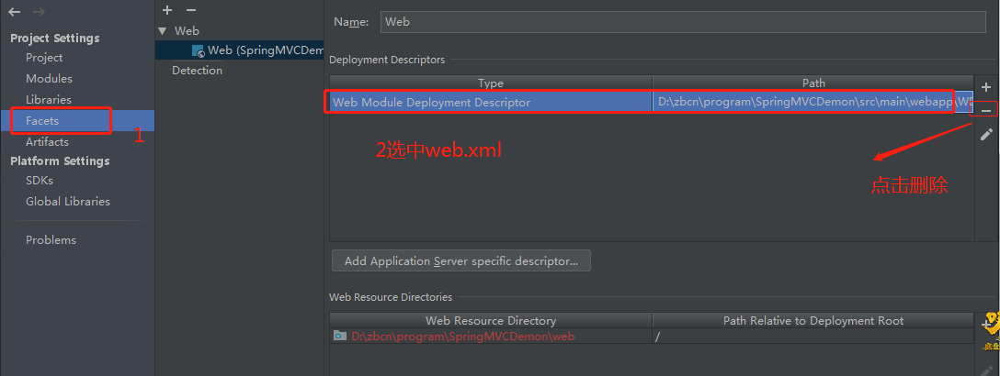

### SpringMVC 搭建note ###

---

1. 创建maven 项目。选中`maven-archetype-webapp`.如下图：
   - 
2. 添加web特性：
   - 
3. 删除旧的web项目：
   -   
4. 新添加web文件：（新添加的web.xml为4.0）
   - 
5. 将旧webapp中旧版本的web.xml 替换web中新生成的web.xml
6. 项目中启用webapp目录
   - 
7. 删除旧的web目录：
   - 
8. 在src/main下添加java、resources、test 三个文件夹，并且指定文件夹自己特有的特性
9. 在`porm.xml`中添加springMVC 特有的依赖、 添加servlet 特有的jar依赖
10. 添加spring特性：
   - .jpg)
   - 在webapp/WEB-INF文件中生成`applicationContext.xml 、dispatcher-servlete.xml`两个文件
   - 在`web.xml`中增配置：
      ```xml
        <context-param>
                <param-name>contextConfigLocation</param-name>
                <param-value>classpath*:/applicationContext.xml</param-value>
            </context-param>
            <listener>
                <listener-class>org.springframework.web.context.ContextLoaderListener</listener-class>
            </listener>
            <servlet>
                <servlet-name>dispatcher</servlet-name>
                <servlet-class>org.springframework.web.servlet.DispatcherServlet</servlet-class>
                <init-param>
                    <!--配置dispatcher.xml作为mvc的配置文件-->
                    <param-name>contextConfigLocation</param-name>
                    <param-value>classpath:/dispatcher-servlet.xml</param-value>
                </init-param>
                <load-on-startup>1</load-on-startup>
                <!--添加异步支持-->
                <async-supported>true</async-supported>
            </servlet>
            <!--
           /* 和/ 的区别：
               /* ：覆盖所有其它的servlet，不管你发出了什么样的请求，最终都会在这个servlet中结束。会匹配所有的url：路径型的和后缀型的url(包括/springmvc，.jsp，.js和*.html等)。
               /: 覆盖任何其它的servlet。它仅仅替换了servlet容器中内建的默认servlet.种形式通常只用来请求静态资源（CSS/JS/image等）和展示目录的列表.会匹配到/springmvc这样的路径型url，不会匹配到模式为*.jsp
           https://stackoverflow.com/questions/4140448/difference-between-and-in-servlet-mapping-url-pattern
           -->
            <servlet-mapping>
                <servlet-name>dispatcher</servlet-name>
                <url-pattern>/</url-pattern>
            </servlet-mapping>
       ```
11. 移动`applicationContext.xml 、dispatcher-servlete.xml`两个文到resources。修改`web.xml` 中`applicationContext.xml 、dispatcher-servlete.xml` 配置路径

12. 添加logback配置
   - `web.xml` 中添加logback配置：
     ```xml
        <context-param>
            <param-name>logbackConfigLocation</param-name>
            <param-value> classpath:/logback.xml</param-value>
        </context-param>
        <listener>
            <listener-class>ch.qos.logback.ext.spring.web.LogbackConfigListener</listener-class>
        </listener>
     ```
   - resources添加logback.xml文件（注意logback.xml 文件内部配置log日志方法）
13. 最终的项目路径 

**说明：**  

 更改ideal 生成的web.xml 版本。
   - 生成的web.xml 版本号：
     ![webxml.2.3]image/projectConstruction/webxml2.3.jpg)
     
   - 由于ideal 默认生成的web.xml为2.3。需要更改为2.5以上。
     
     
   - 注意：test目录和main 平级。否则，test无法执行。
     
     